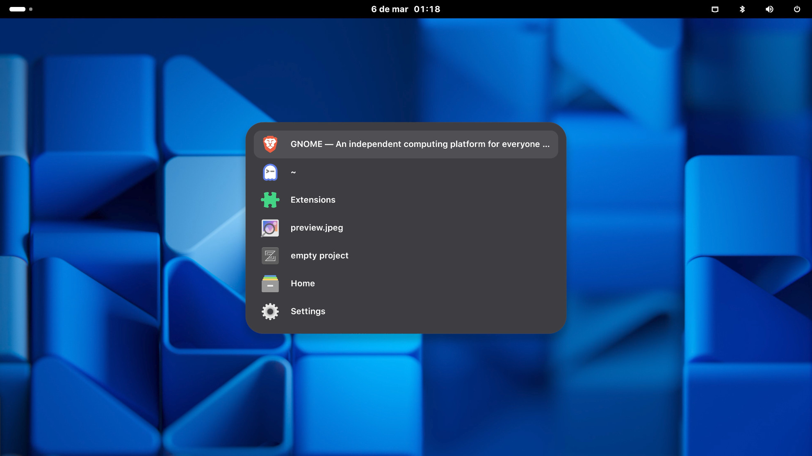

# Alt+Tab List

A GNOME Shell extension that replaces the default Alt+Tab window switcher with a clean, highly predictable vertical list.

By replacing the native grid-style switcher, this extension ensures that your window list is quickly readable and always ordered exactly how you left it. Crucially, it overrides the native GNOME behavior of demoting minimized windows to the back of the queue, keeping your workflow consistent, intuitive, and fast.

## Features

* **Centered Vertical Layout:** Displays a simple list of app icons and window titles directly in the center of your main monitor.
* **Strict Last-Accessed Order:** Windows remain strictly in the order of last access. Minimized windows are no longer punished by being pushed to the end of the list.
* **Quickly Readable:** Scan your open apps instantly from top to bottom without visually hunting through a grid.
* **Scalable:** The list automatically scrolls when you have a large number of open windows, keeping the UI clean.
* **Lightweight Performance:** By completely bypassing GNOME's calls to request window frames from the buffer (which the native switcher uses to render visual previews), this extension consumes fewer resources and reacts instantly.

## Requirements

* GNOME Shell 49, 50